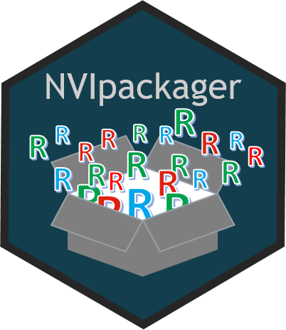

# NVIpackager: Tools to facilitate Development of NVIverse Packages 

<!-- README.md is generated from README.Rmd. Please edit that file -->

-   [Overview](#overview)
-   [Installation](#installation)
-   [Usage](#usage)
-   [Copyright and license](#copyright-and-license)
-   [Contributing](#contributing)

## Overview

`NVIpackager`provides tools to facilitate development of NVIverse
packages. You should use ‘create\_NVIpkg\_skeleton’ to make a package
skeleton in accord with NVIverse standards. For further development and
maintenance there are tools for updating documentation and installing
development versions. The NVIpackager functions are to a large extent
wrappers for devtools and usethis functions. In addition, the templates
folder keeps templates for standard files like sections of README and
CONTRIBUTING.

`NVIpackager` is part of `NVIverse`, a collection of R-packages with
tools to facilitate data management and data reporting at the Norwegian
Veterinary Institute (NVI). The `NVIverse` consists of the following
packages: `NVIconfig`, `NVIdb`, `NVIspatial`, `NVIpretty`, `NVIbatch`,
`OKplan`, `OKcheck`, `NVIcheckmate`, `NVIpackager`, `NVIrpackages`. See
[Contribute to
NVIpackager](https://github.com/NorwegianVeterinaryInstitute/NVIpackager/blob/main/CONTRIBUTING.md)
for more information.

## Installation

`NVIpackager` is available at
[GitHub](https://github.com/NorwegianVeterinaryInstitute). To install
`NVIpackager` you will need:

-   R version &gt; 4.0.0
-   R package `remotes`
-   Rtools version 4.0, 4.2 or 4.3 depending on R version

First install and attach the `remotes` package.

    install.packages("remotes")
    library(remotes)

To install (or update) the `NVIpackager` package without vignettes, run
the following code:

    remotes::install_github("NorwegianVeterinaryInstitute/NVIpackager",
        upgrade = FALSE,
        build = TRUE,
        build_vignettes = FALSE)

To install (or update) the `NVIpackager` package with vignettes, you
will need to first install some additional R-packages needed for
creating the vignettes. Check README to see which vignettes are
available and eventually install the packages: `rmarkdown`, `knitr`,
`R.rsp`, and `NVIrpackages` (from GitHub) if they are missing. To
install the package with the vignettes, run the following code:

    remotes::install_github("NorwegianVeterinaryInstitute/NVIpackager",
        upgrade = FALSE,
        build = TRUE,
        build_vignettes = TRUE)

## Usage

The `NVIpackager` package needs to be attached.

    library(NVIpackager)

`NVIpackager`provides tools to facilitate development of NVIverse
packages. You should use ‘create\_NVIpkg\_skeleton’ to make a package
skeleton in accord with NVIverse standards. For further development and
maintenance there are tools for updating documentation and installing
development versions. The NVIpackager functions are to a large extent
wrappers for devtools and usethis functions. In addition, the templates
folder keeps templates for standard files like sections of README and
CONTRIBUTING.

#### Create a NVIverse package skeleton

To set up a package skeleton you can follow the following procedure:

1.  Create a repository for the package at the
    NorwegianVeterinaryInstitute’s GitHub account. Give the repository
    the name of the package.

    -   Make a short descriptive text. This can later be used as the
        Title in the DESCRIPTION file.
    -   Choose between Public or Private. If unsure, start with Private.
        It is easy to change to Public later.
    -   Mark for Add a README file.
    -   Choose the .gitignore template for R.
    -   Choose a licence, For example MIT, BSD 3-clause

2.  Create the repository.

3.  Fork the repository to your own GitHub account.

4.  Create an R-studio project for the package. In R-studio

    -   Choose New project -&gt; Version control
    -   Copy the directory at GitHub and paste it where asked in
        R-studio.
    -   Select a directory in your PC for your package.

5.  Create the package skeleton

        NVIpackager::create_NVIpkg_skeleton(license_keyword = "BSD_3_clause")

6.  Modify the DESCRIPTION file

    -   Copy the descriptive text into the Title field in the
        DESCRIPTION file.
    -   Copy the descriptive text into the Description field in the
        DESCRIPTION file and eventually extend it.

7.  Update README and Mypackage-package help with the last changes in
    the DESCRIPTION file.

        document_NVIpkg(pkg = stringi::stri_extract_last_words(usethis::proj_path()),
            pkg_path = usethis::proj_path(),
            style = FALSE,
            manual = "update",
            contributing = FALSE,
            readme = TRUE)

#### Maintenance of a NVIverse package

Functions for updating documentation, performing tests, build and
install the package are collected in the file “./notes/develop.R”. You
can run the different sections stepwise during package maintenance and
updating.

#### Further documentation

##### Help

The full list of all available functions and datasets can be accessed by
typing

    help(package = "NVIpackager")

##### Vignettes

Consult the vignettes for task-oriented help.

    vignette(package = "NVIpackager")

Vignettes in package `NVIpackager`:

-   Contribute to NVIpackager (html)  
-   NVIpackager reference manual (pdf)  
-   NVIverse coding conventions (html)

##### NEWS

Please check the
[NEWS](https://github.com/NorwegianVeterinaryInstitute/NVIpackager/blob/main/NEWS)
for information on new features, bug fixes and other changes.

## Copyright and license

Copyright (c) 2021 - 2023 Norwegian Veterinary Institute.  
Licensed under the BSD\_3\_clause License. See
[License](https://github.com/NorwegianVeterinaryInstitute/NVIpackager/blob/main/LICENSE)
for details.

## Contributing

Contributions to develop `NVIpackager` is highly appreciated. There are
several ways you can contribute to this project: ask a question, propose
an idea, report a bug, improve the documentation, or contribute code.
See [Contribute to
NVIpackager](https://github.com/NorwegianVeterinaryInstitute/NVIpackager/blob/main/CONTRIBUTING.md)
for more information.

## <!-- Code of conduct -->

Please note that the NVIpackager project is released with a [Contributor
Code of
Conduct](https://github.com/NorwegianVeterinaryInstitute/NVIpackager/blob/main/CODE_OF_CONDUCT.md).
By contributing to this project, you agree to abide by its terms.
